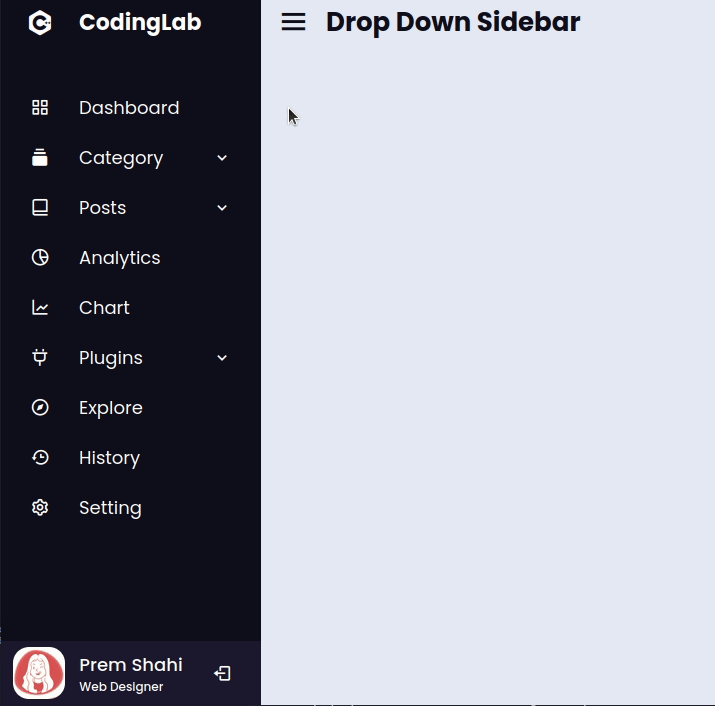

# as-dropdown-sidebar-js

* 클론코딩
* Youtube Chanel "CodingLab"
* [CodingLabResponsive Dropdown Sidebar Menu using HTML CSS and JavaScript | Side Navigation Bar](https://www.youtube.com/watch?v=ES8vJcUqE7s&t=5s)
* 약 40분 32초

## 결과물

## 노트

* `<meta name="viewport" content=...>` 속성은 iOS (safari) 장치에서 널리 사용되는 태그입니다.
* 복습: 자손 선택자 (`space`), 자식 선택자 (>)
* css  블록사이에 오타(영문 1글자)가 들어가면 이하 선택자는 적용이 안됨
* html 요소 중 자식에게 hover 가 되어있으면 상위 요소에 hover 이벤트가 들어가는듯
* pointer-events 와 관련해서 `none` 일경우 링크가 작동하지 않음
  * pointer-events와 opacity를 이용해서 드롭다운을 구현하는게 핵심이였다..!
* object-fit: cover; 속성은 화면이 꽉차지만 비율을 변경하지 않는다.
* position fixed를 bottom으로 주어 화면 아래에 프로필 사진을 구성할 수 있다.
* overflow: auto 의 경우 스크롤을 필요할 때에 추가
* ::-webkit-scrollbar 의 경우 스크롤을 컨트롤 하는데 사용한다.
  * 그러나 크롬에서만 먹히고 사파리에서는 먹히지 않는다.
* UI 가 늘어나 스크롤이 필요할 경우, 아래에 position: fixed 로 가려지는 요소가 있다면 padding을 추가하여 가려지는 요소를 제외한 스크롤링이 가능하도록 한다.
* animation 0.5 초 같은거 지정할때 s 안붙이면 0초 처럼 작동함
* ~ 선택자는 일반 형제 조합자 (General sibling combinator), 첫번째 요소에 이어지는 두번째 요소를 선택한다.
* 37:25 에 이해가 가지 않는것. display 속성을 flex 에서 block 으로 바꿨는데 pointer-evnets 가 정상으로 작동하는 것처럼 보인다.
  * opacity가 0, pointer-events 가 none 인 속성이 display: flex에서는 먹히지 않는다?
* white-space: nowrap: 연속 공백을 하나로, 줄바꿈은   만.
  * pre속성은 연속공백을 유지

## 배운점

